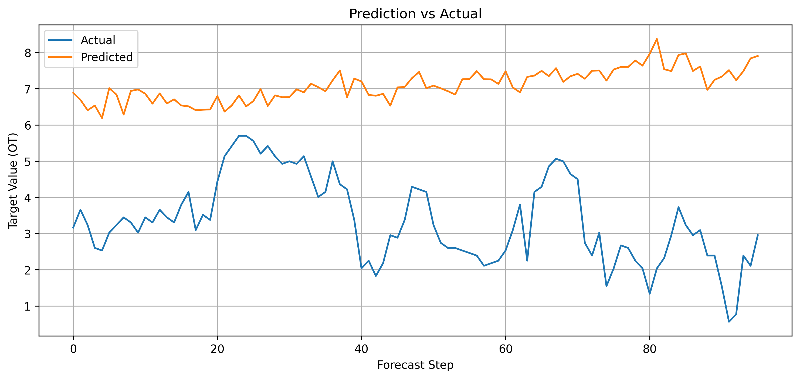
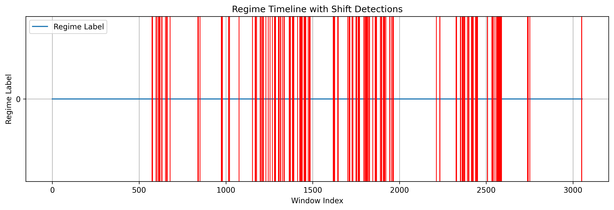
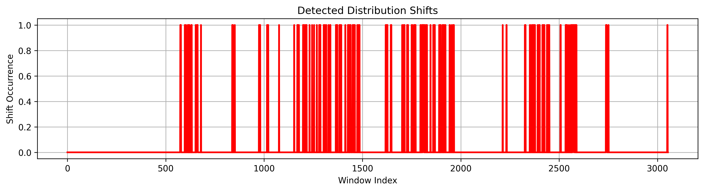
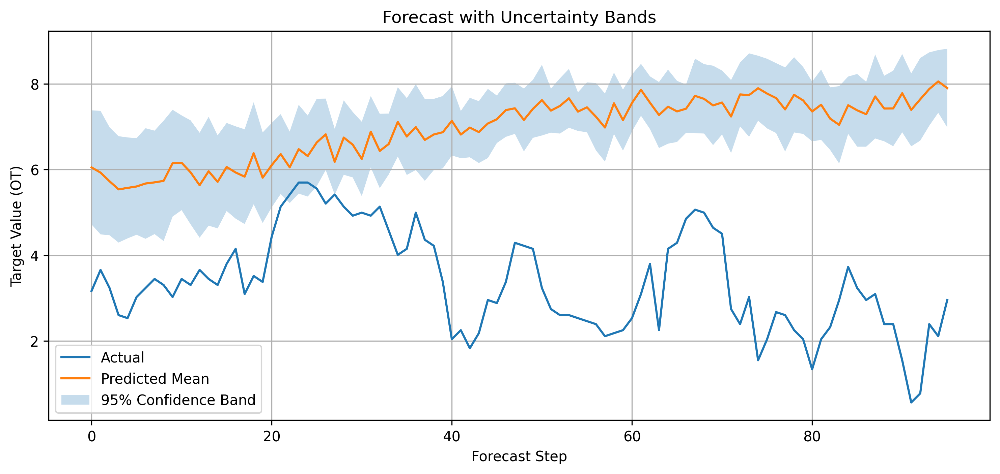

# 🚀 Regime-Aware Transformer for Distribution Shift Detection in Time Series

> 🧠 A deep learning project that detects hidden regime changes and adapts forecasting under non-stationary conditions.

---

## 🌍 Problem Statement

Real-world time series data is rarely stable.

Patterns shift. Systems evolve. Models fail.

> ❗ Traditional models assume **stationarity** — but reality doesn’t.

This project tackles that head-on by building a **regime-aware transformer** that:
- detects hidden behavioral changes  
- adapts predictions dynamically  
- estimates uncertainty during shifts  

---

## ✨ Key Features

### 🔮 Transformer-based Forecasting
- Implemented a **PatchTST-style Transformer**
- Captures long-range dependencies using **self-attention**
- Avoids limitations of RNN/LSTM models

---

### 🧩 Latent Regime Discovery
- Extracted embeddings from transformer encoder
- Applied **KMeans clustering**
- Discovered hidden regimes representing system behavior

---

### 🔄 Distribution Shift Detection
- Identified regime transitions:
    z_t ≠ z_(t-1)

- These transitions signal **structural changes** in the data

---

### 🧠 Regime-Aware Forecasting
- Enhanced model with **regime-conditioned prediction head**
- Uses:
  - temporal embedding 📈  
  - regime embedding 🧬  

➡️ Improves performance in non-stationary environments

---

### 📊 Uncertainty Estimation
- Implemented **Monte Carlo Dropout**
- Outputs:
  - confidence intervals 📉  
  - prediction reliability  
  - uncertainty during regime shifts  

---

## 📂 Dataset

### ⚡ ETTh1 (Electricity Transformer Temperature)

**Why this dataset?**
- Multivariate time series  
- Seasonal + long-term patterns  
- Real-world distribution shifts  
- Standard benchmark in transformer research  

---

## 🛠️ Tech Stack

| Category        | Tools Used |
|----------------|-----------|
| Language       | Python 🐍 |
| Deep Learning  | PyTorch 🔥 |
| Data Handling  | Pandas, NumPy |
| ML Utilities   | scikit-learn |
| Visualization  | matplotlib 📊 |

---

## 📁 Project Structure
regime-aware-transformer/
│
├── src/
│ ├── data/
│ ├── models/
│ ├── regimes/
│ ├── evaluation/
│ └── visualization/
│
├── outputs/
│ ├── regimes/
│ └── plots/
│
├── checkpoints/
│
├── train_baseline.py
├── train_regime_model.py
└── README.md

---

## 📈 Results

### 🧪 Baseline Transformer

- **MAE:** 2.3176  
- **RMSE:** 2.8540  
- **sMAPE:** 32.29%  

---

### 🚀 Regime-Aware Transformer

- **MAE:** 2.2982  
- **RMSE:** 2.9173  
- **sMAPE:** 31.95%  

✅ Validation loss improved:
0.3012 → 0.2664

---

### 🔍 Regime Discovery

- Number of regimes: **3**
- Silhouette score:
  - Train: **0.6144**
  - Test: **0.4473**

- Regime shifts detected: **199 / 3054 windows**
- Shift rate: **6.52%**

---

### 🎯 Uncertainty Estimation

- 95% Interval Coverage: **31.84%**
- Avg Interval Width: **2.2220**

⚠️ Insight:
> Model shows **overconfidence** → needs better calibration

---

## 📊 Visualizations

### 📈 Prediction vs Actual

---

### 🧭 Regime Timeline

---

### 🔄 Regime Shift Detection

---

### 🌫️ Forecast Uncertainty

---

## 💡 Why This Project Matters

Most models assume:

> “The future behaves like the past.”

That’s not true in:

- 📉 Financial markets  
- ⚡ Energy systems  
- 👥 User behavior  
- 🌐 Sensor environments  

This project shows how to:
- detect **hidden changes**
- adapt models dynamically
- quantify uncertainty during instability  

---

## 🔮 Future Improvements

- 🔧 Better uncertainty calibration  
- 📊 Gaussian Mixture Models (soft regimes)  
- ⚡ Online/real-time regime detection  
- 🧠 Larger transformer architectures  
- 📦 More benchmark datasets  
- 🌐 Interactive dashboard (Streamlit)  

---

## 👩‍💻 Author

Deep Learning project focused on:

- Non-stationary time series  
- Representation learning  
- Real-world ML robustness  

